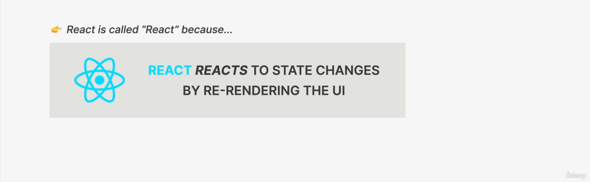

Hooks are only called at the top level of your component. Don't call hooks inside loops, conditions, or nested functions.

# Don't set state manually

- React is all about immutability. You should never mutate the state directly. Instead, you should use the setState method to update the state.
- Update state based on the current state. This is because React may batch multiple setState calls into a single update for performance.

```jsx
// Don't do this
setCount(count + 1);

// Do this
setCount((prevCount) => prevCount + 1);
```




---


---

# Controlled Elements

- In React, form elements are controlled components. This means that the form elements are controlled by the state of the component.

```jsx
import React, { useState } from "react";

function App() {
  const [name, setName] = useState("");

  return (
    <div>
      <input
        type="text"
        value={name}
        onChange={(e) => setName(e.target.value)}
      />
      <p>{name}</p>
    </div>
  );
}

export default App;
```

# State vs Props

- State is used to store the data that the component needs to render.
- Props are used to pass data from a parent component to a child component.

## 
